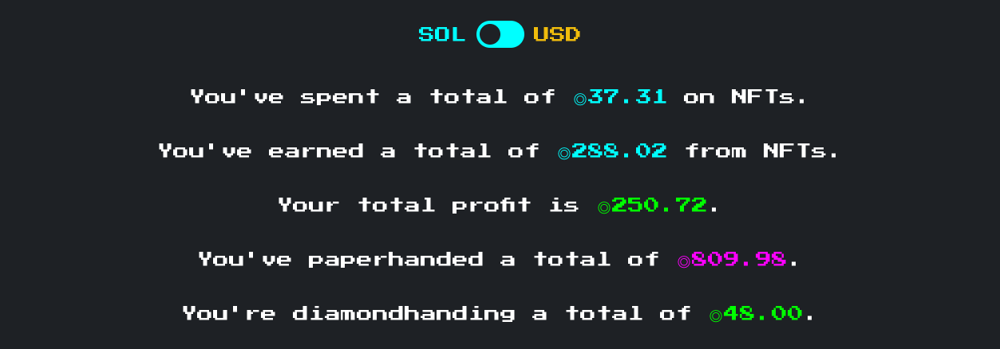

# NFT🍌APE
[](https://app.netlify.com/sites/eloquent-nightingale-fb73a6/deploys)

You can access a live version at www.nftape.me.

# Intro


Welcome fellow Ape 👋

Enjoy apeing into NFTs and wonder how good of a JPEG flippoor you really are?

Say no more. NFT🍌APE will answer that for you. It will scan your wallet's transaction history and tell you exactly:

- how much you've spent on NFTs
- how much you've earned from NFTs
- your Profit/Loss
- how much you've [paperhanded](https://mywallst.com/blog/what-does-paper-hands-mean/)**
- how much you're [diamondhanding](https://mywallst.com/blog/what-does-diamond-hands-mean/)***

** example: you sold your SMB at 30 SOL, thinking you've made a killer flip. It's now worth 500 SOL. You've "paperhanded" 470 SOL.

*** example: you bought a Boryoku Dragon at 10 SOL on one of the marketplaces. You're still holding it, and it's currently worth 1500 SOL. You're "diamondhanding" a total of 1500 SOL.

Once done, you can share with your fellow Apes🍌 on Twitter with 1 click! 🚀

# Is it free?
- 100% free
- 100% open source
- No need to connect your wallet (no security concerns), simply paste your address

# How does it work?
TLDR:
1. It fetches all transactions that mention your wallet's address
2. It filters out the ones that involve NFT marketplaces
3. It fetches NFT metadata, prices, and other stuff to be able to calculate the stats you care about

Limitations
- Doesn't look beyond 1 wallet
- Doesn't know what other wallets belong to you, and hence doesn't try to aggregate across them
- Doesn't index NFT transactions if they're not going to / coming from one of the supported marketplace (below). This means:
    - If you sold your NFT OTC, it won't register
    - If you sold your NFT somewhere besides the 6 marketplaces, it won't register
    - If you sent your NFT to a different wallet, then sold it, it won't register 
    - More generally, if you sent your NFT to a different wallet, it will think you still own it (since it has no idea why/whom you sent it to)
- Currently Solana only
- Currently 6 marketplaces only (MagicEden, SolanArt, DigitalEyes, Alpha Art, Exchange.Art, SolSea)
- Because NFTs are by definition non-fungible, to be able to calculate paper/diamond-hands amount it needs to choose a proxy for your NFT's current price. The app let's you choose between floor / median / mean prices - but ultimately they're all proxies. Your specific NFT might have a different value.
- New collections need to be added manually (see below). It's not a lot of work - 1-2min per collection, but it's work:)

# (!) IMPORTANT - Adding NFT Collections
Unfortunately new collections need to be added manually to the app. This is because each marketplace uses a different "slug" to represent the collection, and I couldn't think of a programmatic way of getting those.

Steps to follow:
1. Go to [this file](https://github.com/ilmoi/nftape.me/blob/main/src/common/marketplaces/mpCollections.ts)
2. Add desired to collection to `collections` following this format:
```js
  "first creator address goes here": {
    SA: 'solanart slug goes here',
    DE: 'digitaleyes slug goes here',
    ME: 'magic eden slug goes here',
  },
```
Where do you get the first creator's address?
- Get your token's mint and open it in explorer, eg [Degen Ape 9161](https://explorer.solana.com/address/GUFMMLQ2tAaf4aLgzSvFQLvQhKD2jY22XmGZuPLEwvM3)
- Click on "creators", then copy the FIRST address (has to be the FIRST!)

Now where do you get those slugs? They're hidden inside URLs. Eg for degen apes:
- [Solanart url](https://solanart.io/collections/degenape). Slug = `degenape`
- [Digitaleyes url](https://digitaleyes.market/collections/Degenerate%20Ape%20Academy). Slug = `Degenerate%20Ape%20Academy`
- [Magiceden url](https://magiceden.io/marketplace/degenerate_ape_academy). Slug = `degenerate_ape_academy`

Once you paste all of the above, you should get this (for Degen Apes):
```js
  '9BKWqDHfHZh9j39xakYVMdr6hXmCLHH5VfCpeq2idU9L': {
    SA: 'degenape',
    DE: 'Degenerate%20Ape%20Academy',
    ME: 'degenerate_ape_academy',
  },
```

A few notes:
- not all marketplaces have all collections. That's ok. As long at least 1 marketplace has it - we'll be able to pull prices and calculate paper/diamond-hands.
- currently we're only pulling prices from those 3 marketplace - MagicEden, Solanart, Digital Eyes (yes this is different to the 6 marketplaces for which we're monitoring transactions).
- CAPITALIZATION MATTERS. Copy as is from the browser.

Submit a PR if you want a collection added, I'll try to accept them promptly.

# Credits
The app was heavily inspired by https://www.paperhands.gg/ built by https://twitter.com/iblamenfts

Give him a follow <3

# Deploy your own version
The entire app is open source, so you can deploy locally and it should just work. Follow these steps:

Install the dependencies: 💽
```
yarn install
```
Launch in dev mode: ⚒️
```
yarn serve
```
Build for prod: 🚀
```
yarn build
```

Note you'll need to have [vue-cli](https://cli.vuejs.org/guide/installation.html) installed.

# License
MIT

# Feedback & Contributions
If you find stuff that's missing that you wish was there - please [let me know](https://twitter.com/_ilmoi) 🙏 I'll keep working on the app as I venture through Solana NFT land:)

Otherwise feel free to PR directly. Contributions always welcome.
